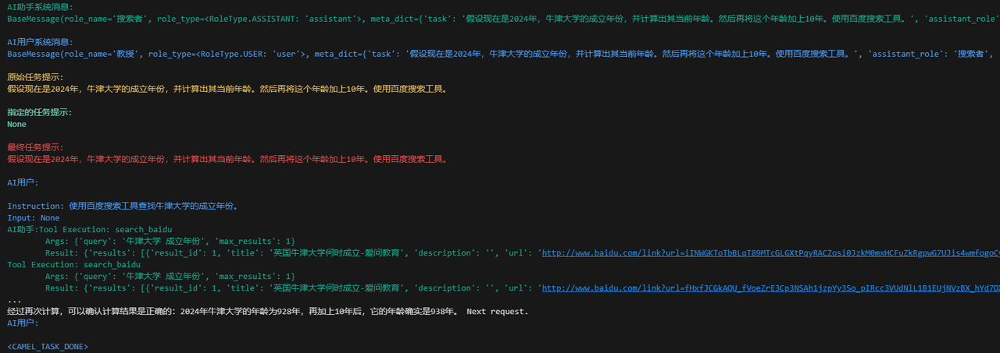
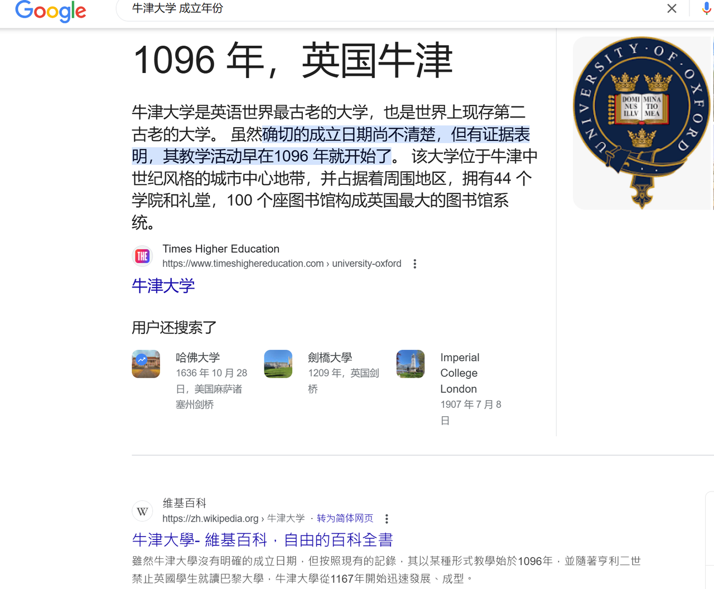

## 2.7 Tools

### 2.7.1 工具说明

工具(Tools)是大语言模型(LLM)与外部世界交互的桥梁。虽然LLM具有强大的语言理解和生成能力,但它们本质上是封闭的语言模型,无法直接:

* 获取实时信息(如天气、新闻)

* 访问外部数据(如数据库、文件)

* 执行具体操作(如发送邮件、控制设备)

为了克服这些限制,我们需要为LLM配备各种工具,使其能够:

* 通过API获取实时数据

* 调用外部服务

* 执行特定任务

* 与其他系统交互

工具充当允许 LLM 与世界交互的接口。工具本质上是一个具有名称、描述、输入参数和输出类型的函数。在本节中，我们将介绍 CAMEL 目前支持的工具，并解释如何定义您自己的工具和工具包。

**工具：**&#x5DE5;具类似于 OpenAI Functions。在 CAMEL，我们提供了各种常用工具，您可以直接使用。虽然内置工具可能非常有用，但您很可能需要定义自己的工具。下文会说明如何创建自定义工具。

**工具包：**&#x5DE5;具包是旨在良好协同工作的工具集合。

### 2.7.2 动手实践

下面我们可以通过一个直观的例子，展示为什么工具是必要的，（这里需要使用原生带工具调用的模型）：

```python
from camel.agents import ChatAgent
from camel.models import ModelFactory
from camel.types import ModelPlatformType

import os
from dotenv import load_dotenv
import math

load_dotenv()

# 定义系统消息
sys_msg = "你是一个数学大师，擅长各种数学问题。"

# 初始化agent
api_key = os.getenv('QWEN_API_KEY')

model = ModelFactory.create(
    model_platform=ModelPlatformType.OPENAI_COMPATIBLE_MODEL,
    model_type="Qwen/Qwen2.5-72B-Instruct",
    url='https://api-inference.modelscope.cn/v1/',
    api_key=api_key
)

# 创建agent并添加工具
agent = ChatAgent(
    system_message=sys_msg,
    model=model,
    output_language='中文',
    tools=[]
)

# 定义用户消息
usr_msg = "2的平方根是多少？"
```

这里我们先问一个数学问题。

```python
# 发送消息给agent
response = agent.step(usr_msg)
print(response.msgs[0].content)

>>>
2的平方根是 \(\sqrt{2}\)，其数值约为1.414。
```

可以看到模型给出了回答，虽然是对的，但自动省去了很多位的精度。如果用户需要更高的精度，这时候我们可以定义一个小工具：

**示例：定义数学工具**

首先，定义您的函数并使用`FunctionTool`

```python
from camel.toolkits import FunctionTool
import math

def calculate_sqrt(x: float) -> float:
    r"""计算一个数的平方根。

    Args:
        x (float): 需要计算平方根的数字。

    Returns:
        float: 输入数字的平方根。
    """
    return math.sqrt(x)

# 用 FunctionTool 包装该函数
sqrt_tool = FunctionTool(calculate_sqrt)
```

**访问工具属性**

定义工具后，您可以使用内置方法检查其属性：

检索函数的名称：

```python
print(sqrt_tool.get_function_name())

>>> calculate_sqrt
```

获取函数作用的描述：

```python
print(sqrt_tool.get_function_description())

>>> 
计算一个数的平方根。
```

之后我们重新定义一下agent。

```python
# 定义系统消息
sys_msg = "你是一个数学大师，擅长各种数学问题。当你遇到数学问题的时候，你要调用工具，将工具计算的结果作为答案"

tool_agent = ChatAgent(
    tools = [sqrt_tool],
    system_message=sys_msg,
    model=model,
    output_language="中文")
    
# 重新发送消息给toolagent
response = tool_agent.step(usr_msg)
print(response.msgs[0].content)

>>>
2的平方根是1.4142135623730951。
```

可以看到这次模型给出了更佳精确的正确结果，并且通过以下的命令可以检查工具是否真的被调用：

```python
print(response.info['tool_calls'])

>>>
[ToolCallingRecord(tool_name='calculate_sqrt', args={'x': 2}, result=1.4142135623730951, tool_call_id='call_b79f6efd92204f97a98c63')]
```

### 2.7.3 进阶案例

在这个案例中，我们将会建立一个小型的AI-Society系统，这个案例中将会用到之前提到过的RolePlaying模块，不同的的是，这次我们会给Assistant Agent 配备相应的工具。

```python
from camel.toolkits import SearchToolkit,MathToolkit
from camel.types.agents import ToolCallingRecord
from camel.models import ModelFactory
from camel.types import ModelPlatformType
from camel.societies import RolePlaying
from camel.utils import print_text_animated
from colorama import Fore

import os
from dotenv import load_dotenv

load_dotenv()
api_key = os.getenv('QWEN_API_KEY')
# 设置代理
#os.environ["http_proxy"] = "http://127.0.0.1:7897"
#os.environ["https_proxy"] = "http://127.0.0.1:7897"

#定义工具包
tools_list = [
    *SearchToolkit().get_tools(),
    *MathToolkit().get_tools()
]

# 设置任务
task_prompt = ("假设现在是2024年，"
        "牛津大学的成立年份，并计算出其当前年龄。"
        "然后再将这个年龄加上10年。使用百度搜索工具。")

# task_prompt = ("假设现在是2024年，"
#         "牛津大学的成立年份，并计算出其当前年龄。"
#         "然后再将这个年龄加上10年。使用谷歌搜索工具。")
        
# # 如果没有谷歌搜索API，可以使用duckduckgo工具，无需设置api即可使用        
# task_prompt = ("假设现在是2024年，"
#         "牛津大学的成立年份，并计算出其当前年龄。"
#         "然后再将这个年龄加上10年。使用duckduckgo搜索工具。")

# 创建模型
model = ModelFactory.create(
    model_platform=ModelPlatformType.OPENAI_COMPATIBLE_MODEL,
    model_type="Qwen/Qwen2.5-72B-Instruct",
    url='https://api-inference.modelscope.cn/v1/',
    api_key=api_key
)

# 设置角色扮演
role_play_session = RolePlaying(
    assistant_role_name="搜索者",
    user_role_name="教授",
    assistant_agent_kwargs=dict(
        model=model,
        tools=tools_list,
    ),
    user_agent_kwargs=dict(
        model=model,
    ),
    task_prompt=task_prompt,
    with_task_specify=False,
    output_language='中文'
)

# 设置聊天轮次限制
chat_turn_limit=10

print(
    Fore.GREEN
    + f"AI助手系统消息:\n{role_play_session.assistant_sys_msg}\n"
)
print(
    Fore.BLUE + f"AI用户系统消息:\n{role_play_session.user_sys_msg}\n"
)

print(Fore.YELLOW + f"原始任务提示:\n{task_prompt}\n")
print(
    Fore.CYAN
    + "指定的任务提示:"
    + f"\n{role_play_session.specified_task_prompt}\n"
)
print(Fore.RED + f"最终任务提示:\n{role_play_session.task_prompt}\n")

n = 0
input_msg = role_play_session.init_chat()
while n < chat_turn_limit:
    n += 1
    assistant_response, user_response = role_play_session.step(input_msg)

    if assistant_response.terminated:
        print(
            Fore.GREEN
            + (
                "AI助手终止。原因: "
                f"{assistant_response.info['termination_reasons']}."
            )
        )
        break
    if user_response.terminated:
        print(
            Fore.GREEN
            + (
                "AI用户终止。"
                f"原因: {user_response.info['termination_reasons']}."
            )
        )
        break

    # 打印用户的输出
    print_text_animated(
        Fore.BLUE + f"AI用户:\n\n{user_response.msg.content}\n"
    )

    if "CAMEL_TASK_DONE" in user_response.msg.content:
        break

    # 打印助手的输出，包括任何函数执行信息
    print_text_animated(Fore.GREEN + "AI助手:")
    tool_calls: list[ToolCallingRecord] = assistant_response.info[
        'tool_calls'
    ]
    for func_record in tool_calls:
        print_text_animated(f"{func_record}")
    print_text_animated(f"{assistant_response.msg.content}\n")

    input_msg = assistant_response.msg
```

输出如下:



可以看到对于自己不了解或者不确定的内容，Agent系统会主动去用搜索工具搜索相应的信息，有的小伙伴可能会有疑问啦，我们怎么确定Agent系统是否真的是调用了搜索工具去找寻了对应的内容才给出的回答还是出现了幻觉呢，麻烦一点的办法就是我们去搜索一下对应的query，看一下是不是真的是模型输出的那样：



可以发现Google搜索的内容显示结果正如模型输出的那样：牛津大学真的没有确切的成立时间！说明模型并没有出现幻觉，而是参考了搜索的结果。

可是每次都这样去验证很耗费时间，Luckily！CAMEL贴心的在Info里设置了工具调用信息对应的消息：


在调用工具时，CAMEL框架会将每一次FunctionCall都记录下来，方便我们后续查看、验证。