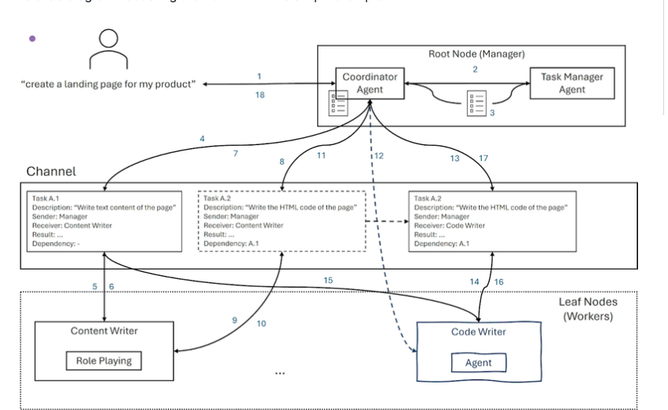

## 3.1   CAMEL框架简介&#x20;

### 3.1.1 Multiple Agent基本概念

* **定义**：多智能体（Multiple Agent）由多个相互作用的智能体组成，每个智能体都有自己的目标和策略。这些智能体可以相互通信、协作或竞争，以实现更复杂的行为和决策。

* **应用**：多智能体系统广泛应用于复杂的任务中，如交通管理、分布式机器人系统、经济市场模拟、多玩家游戏等。

* **特点**：

  * **协作**：智能体之间可以协作，共同解决问题。

  * **竞争**：智能体之间也可以存在竞争关系，如在拍卖或游戏场景中。

  * **自主性**：每个智能体都有自己的决策过程，保持一定程度的自主性。

  * **复杂性**：多智能体系统的设计与分析比单一智能体系统更复杂，因为需要考虑智能体之间的交互和协调。

  * **鲁棒性**：多智能体系统通常具有更好的鲁棒性，因为系统的稳定性和效能不完全依赖于单一决策者。&#x20;

### 3.1.2 什么是CAMEL?

CAMEL (Communicative Agents for "Mind" Exploration of Large Language Models) 是一个开源的多智能体框架，专注于构建基于大语言模型的智能体交互系统。该框架通过角色扮演和结构化对话机制，实现智能体之间的有效协作。

在CAMEL框架中，ChatAgent 是最基础的智能体单元，负责处理对话逻辑和任务执行。而`RolePlaying` 和`Workforce` 则是多智能体系统，用于协调多个智能体的协作。

详见我们的开源仓库和项目主页&#x20;

* 论文：<https://ghli.org/camel.pdf>

* 项目主页：<https://www.camel-ai.org/>&#x20;

### 3.1.3  ChatAgent 简介

ChatAgent 是 CAMEL 框架的基础构建块，其设计目标是回答以下问题：“如何设计一个自主的交互式智能体，使其能够在最少人工监督的情况下，引导对话完成任务？”

在当前实现中，我们的智能体具备以下关键特性：&#x20;

* **角色 (Role)**：结合目标和内容规范，设定智能体的初始状态，引导智能体在连续交互过程中采取行动。

* **大语言模型 (LLMs)**：每个智能体都使用大语言模型来增强认知能力。大语言模型使智能体能够理解和生成自然语言，从而解释指令、生成响应并参与复杂对话。

* **记忆 (Memory)**：包括上下文记忆和外部记忆，使智能体能够以更扎实的方式进行推理和学习。

* **工具 (Tools)**：智能体可以使用的一组功能，用于与外部世界交互，本质上是为智能体提供具身化能力。

* **通信 (Communication)**：我们的框架允许智能体之间进行灵活且可扩展的通信，这是解决关键研究问题的基础。

* **推理 (Reasoning)**：我们为智能体配备了不同的规划和奖励（评论员）学习能力，使其能够以更有指导性的方式优化任务完成。

### 3.1.4  Role Playing机制

RolePlaying是CAMEL框架的独特合作式智能体框架。该框架通过预定义的提示词为不同的智能体创建唯一的初始设置，帮助智能体克服诸如角色翻转、助手重复指令、模糊回复、消息无限循环以及对话终止条件等多个挑战。

#### 3.1.4.1 基本概念

1.1 **角色定义**

* **Assistant角色**: 负责执行具体任务并提供解决方案的智能体

* **User角色**: 负责提供指令和任务需求的智能体

* **特定领域角色**: 如程序员、交易员等专业角色

1.2 **交互规则**

```python
# 初始prompt示例参考
system_message = """
===== RULES OF ASSISTANT =====
1. Never forget you are a {ASSISTANT_ROLE} and I am a {USER_ROLE}
2. Never flip roles! Never instruct me!
3. You must decline my instruction honestly if you cannot perform it
4. Always start with: Solution: <YOUR_SOLUTION>
5. Always end with: Next request.
"""
```

**1.3 关键机制**

* **角色固定**: 防止角色翻转，维持对话的稳定性

* **格式规范**: 要求回复具有固定的开始和结束格式

* **任务分解**: 自动将复杂任务分解为可执行的子任务

* **循环对话**: 通过轮流发言推进任务进展

**2.工作流程**

2.1 **初始化阶段&#x20;**

* 设定角色身份

* 加载系统提示词

* 明确任务目标

2.2 **执行阶段&#x20;**

* User提供具体指令

* Assistant执行并给出解决方案

* 循环往复直至完成任务bi

#### 3.1.4.2 经典案例: 股票交易机器人详解

以下是一个对于Role-Playing的经典应用， 股票交易实例。在本案例中，我们通过角色扮演的方式来构建一个交易机器人。初始阶段，人类用户提出一个概念性任务，由一个专用Agent精确化为详细的任务描述。参与完成任务的有两个agent：一个扮演股票交易员，另一个扮演Python程序员。

**工作流程：**

```python
from colorama import Fore

from camel.societies import RolePlaying
from camel.utils import print_text_animated

def main(model=YOUR_MODEL, chat_turn_limit=50) -> None:
    task_prompt = "Develop a trading bot for the stock market"
    role_play_session = RolePlaying(
        assistant_role_name="Python Programmer",
        assistant_agent_kwargs=dict(model=model),
        user_role_name="Stock Trader",
        user_agent_kwargs=dict(model=model),
        task_prompt=task_prompt,
        with_task_specify=True,
        task_specify_agent_kwargs=dict(model=model),
    )
```

以上代码中，`task_prompt` 是用户输入的任务提示词，即“Develop a trading bot for the stock market”。创建 `role_play_session` 时，将 `task_prompt` 传递给了 `RolePlaying`。`RolePlaying`的作用是根据任务提示词，将任务分解为具体的任务小点，并与相应的AI角色进行交互。

具体来说，在这个例子中，助手角色是“Python Programmer”，用户角色是“Stock Trader”。通过这种方式，框架中的Agent可以将用户输入的较为抽象的任务转化为具体的任务小点，以便更好地进行交互和实现具体的功能。

这种设计可以帮助Agent更有针对性地理解任务，并根据具体的任务小点进行回答和执行操作。通过角色扮演会话，即使用户不懂技术，也能实现复杂的想法。Agent们们会通过对话和合作来帮助用户将想法转化为现实。这种方法不仅使得技术实现变得更加容易，也为人工智能的应用开辟了新的可能性，让创造变得更加简单和有趣。


&#x20;RolePlaying工作流程图

**&#x20;角色设定：** &#x20;

* Python程序员(Assistant)：负责实现交易逻辑和代码

* 股票交易员(User)：提供交易策略和业务需求

**任务具体化**

任务具体化Agent将初步想法转换成详细任务描述：“开发一个基于机器学习的股票交易机器人，能够自动分析市场趋势、执行买卖操作，并实时调整策略以优化投资组合。”


**具体过程**

* **步骤1: 任务提出**

人类用户提出希望开发一个交易机器人。

* **步骤2: 定义AI角色**

设定合适的AI角色（股票交易员和Python程序员）来实现用户的想法。

* **步骤3: 任务具像化**

任务具体化Agent为AI角色提供明确的任务描述，以便更好地理解和执行。比如：将“开发一个用于股票市场的交易机器人。”进一步具像为：“开发一个基于机器学习的股票交易机器人，能够自动分析市场趋势、执行买卖操作，并实时调整策略以优化投资组合。”

* **步骤4: 任务拆分**

总体任务会由AI用户（股票交易员）来进一步拆分为各个子任务，确保AI助手（Python程序员）能够理解并执行子任务。例如：

* **步骤5: 对话和合作**

程序员AI和交易员AI开始对话和合作：

* **步骤6: 完成任务**

通过这种对话和合作的方式，两个AI角色能够一步步地共同完成任务，最终创建出一个用于股票市场的交易机器人。

示例视频(model使用qwen2.5:7b)：

[QQ2024123-225913-HD.mp4](https://github.com/datawhalechina/handy-multi-agent/tree/main/docs/files/QQ2024123-225913-HD.mp4)

### 3.1.5 Workforce 简介

Workforce是CAMEL框架中的一个多智能体协同工作系统。它以一种简洁的方式让多个智能体协作完成任务，类似于一个高效的团队合作系统。

更详细的使用信息，请参考我们的[对应内容](https://fmhw1n4zpn.feishu.cn/docx/AF4XdOZpIo6TOaxzDK8cxInNnCe#share-T4t0dbCrqoKV1qx8EbdcIAtpnwb)

**架构设计**

Workforce采用层级架构设计。一个workforce可以包含多个工作节点(worker nodes)，每个工作节点可以包含一个或多个智能体作为工作者。工作节点由workforce内部的协调智能体(coordinator agent)管理，协调智能体根据工作节点的描述及其工具集来分配任务。

除了协调智能体外，workforce内部还有一个任务规划智能体(task planner agent)。任务规划智能体负责任务的分解和组合，使workforce能够逐步解决任务。

**通信机制**

Workforce内部的通信基于任务通道(task channel)。Workforce初始化时会创建一个所有节点共享的通道。任务会被发布到这个通道中，每个工作节点会监听通道，接受分配给它的任务并解决。

当任务完成后，工作节点会将结果发布回通道，结果会作为其他任务的"依赖项"保留在通道中，供所有工作节点共享。

通过这种机制，workforce能够以协作和高效的方式解决任务。

**故障处理**

Workforce具有故障处理机制。当任务失败时，协调智能体会采取行动修复。这些行动可以是：

* 将任务分解为更小的任务并重新分配

* 创建一个能够完成该任务的新工作者

目前，协调智能体根据任务被分解的次数来做决策：

* 如果任务已经被分解超过特定次数，协调智能体会创建新的工作者

* 如果没有超过，协调智能体会采取任务分解的行动

有些任务可能智能体根本无法解决。为了防止workforce陷入无限的智能体创建循环，如果一个任务失败次数超过特定次数（默认为3次），workforce将会停止。

**Workforce 实例讲解**

这一部分将通过以下多智能体工作流（multi agent workforce）展示如何利用多个智能体（agents）和角色分工完成复杂任务



**总体概述**

该系统由多个智能体（agents）组成，每个智能体在一个组织结构中扮演特定角色，协同完成复杂任务。流程图展示了如何通过以下智能体协作完成一个请求（如“创建一个产品的登录页面”）：

* **Root Node (Manager)**：作为系统的管理者，负责接收任务并协调任务的分解和分配。

* **Coordinator Agent (协调智能体)** 和 **Task Manager Agent (任务管理智能体)**：管理任务分解、依赖关系、分发任务，以及监控任务完成情况。

* **Leaf Nodes (Workers)**：执行任务的实际智能体，分别承担不同的角色（如“内容撰写者”和“代码撰写者”）。

**流程讲解**

**(a) 用户需求的接收**

用户发出任务请求（例如“创建一个登录页面”，图中 1）。

**Coordinator Agent** 接收需求，作为入口点。

**(b) 任务分解与定义**

**Coordinator Agent** 通过任务分解策略，将请求拆分为多个子任务（如任务 A.1 和 A.2），并定义：

1.  每个任务的描述。
2.  任务的发送者和接收者。
3.  任务之间的依赖关系。

这些任务被送到 **Task Manager Agent** 进行分发（图中 2 和 3）。

**(c) 任务的分配**

**Task Manager Agent** 将任务分发到 **Channel**（图中 4），这是一个任务管理中枢。

任务按角色需求分配到 **Leaf Nodes (Workers)**，包括：

1.  **任务 A.1**：分配给 **Content Writer（内容撰写者）**。
2.  **任务 A.2**：分配给 **Code Writer（代码撰写者）**。

**(d) Leaf Nodes 执行任务**

**内容撰写者 (Content Writer)**：

1. 接收到任务 A.1（“撰写页面文本内容”）并执行（图中 5 和 6）。

2. 输出结果通过通道返回（图中 9 和 10）。

**代码撰写者 (Code Writer)**：

1. 等待任务 A.1 的完成，因为任务 A.2 依赖 A.1 的输出。

2. 接收到任务 A.1 的结果后，开始执行任务 A.2（“撰写 HTML 代码”，图中 14 和 16）。

3.  任务完成后将结果返回（图中 15 和 17）。

**(e) 结果整合与返回**

**Coordinator Agent** 汇总所有任务结果（如 A.1 和 A.2 的结果）。

将完整的任务结果返回给用户（图中 18）。

**多智能体工作流系统特性**

**任务分解**：将复杂任务分解为简单子任务。

**角色分工**：根据任务类型分配给不同智能体。

**依赖管理**：智能管理任务之间的依赖关系。

**高效协作**：智能体协同工作，快速完成目标

由于多智能体工作流的系统特性，该流程可适用于多个角色分工协作饿的场景，如软件开发、内容生产和项目管理等。