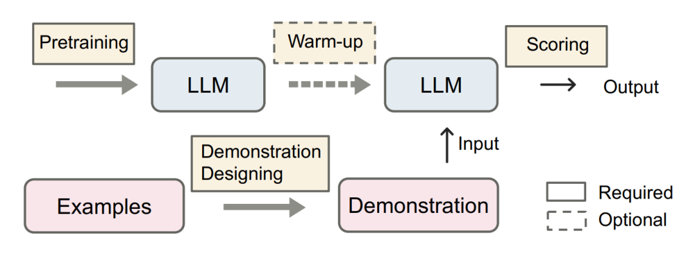
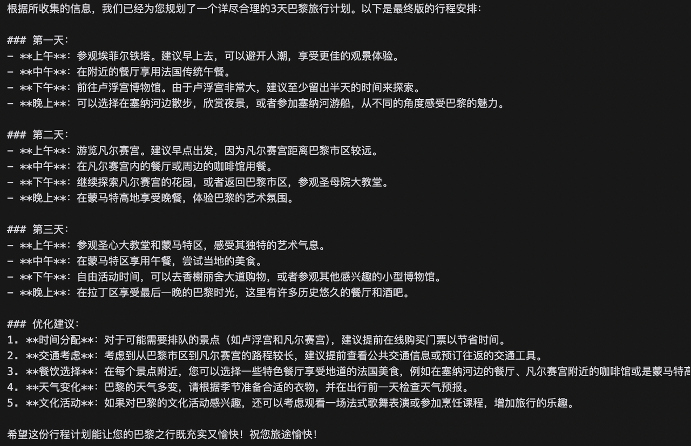

## 3.3 创建你的Workforce

### 3.3.1 简单实践

**1. 创建 Workforce 实例**

想要使用 Workforce，首先需要创建一个 Workforce 实例。下面是最简单的示例：

```python
from camel.agents import ChatAgent
from camel.models import ModelFactory
from camel.types import ModelPlatformType
from camel.messages import BaseMessage
from camel.societies.workforce import Workforce
from camel.toolkits import SearchToolkit
from camel.tasks import Task
from camel.toolkits import FunctionTool

import os


model = ModelFactory.create(
            model_platform=ModelPlatformType.OPENAI_COMPATIBLE_MODEL,
            model_type="你的模型",
        )
        
# 创建一个 Workforce 实例
workforce = Workforce(description="旅游攻略制作与评估工作组",new_worker_agent_kwargs={'model':model},coordinator_agent_kwargs={'model':model},task_agent_kwargs={'model':model})
```

这段代码会生成一个名为 `一个简单的Workforce` 的实例，不过目前它还不包含任何工作节点。

> **提示：如何自定义 Workforce**
>
> 如果你只想快速上手，给 Workforce 传入一个描述就足够了；如果你需要更复杂的定制，则可以在初始化时配置工作节点列表、协调器Agent（Coordinator Agent）或任务规划Agent（Task Planner Agent）等高级参数。

***

**2. 定义worker**

接下来，我们需要给Workforce定义一些worker。我们希望在这个Workforce里有一个专业的旅游信息搜索助手、一个专业的旅行规划师、一个经验丰富的旅行爱好者。他们分别负责制定计划和评价计划，例如：

```python
search_tool = FunctionTool(SearchToolkit().search_duckduckgo)

search_agent = ChatAgent(
            system_message="""你是一个专业的旅游信息搜索助手。你的职责是:
                1. 搜索目的地的主要景点信息
                2. 搜索当地特色美食信息
                3. 搜索交通和住宿相关信息
                请确保信息的准确性和实用性。""",
            model=model,
            tools=[search_tool],
            output_language='中文'
        )

planner_agent = ChatAgent(
            system_message="""你是一个专业的旅行规划师。你的职责是:
                1. 根据景点分布规划合理的游览顺序
                2. 为每天安排适量的景点和活动
                3. 考虑用餐、休息等时间
                4. 注意不同季节的特点
                请确保行程安排合理且具有可行性。""",
            model=model,
            output_language='中文'
        )

reviewer_agent = ChatAgent(
    system_message="""你是一个经验丰富的旅行爱好者。你的职责是:
        1. 从游客角度评估行程的合理性
        2. 指出可能的问题和改进建议
        3. 补充实用的旅行小贴士
        4. 评估行程的性价比
        请基于实际旅行经验给出中肯的建议。""",
    model=model,
    output_language='中文'
)

```

当然，你也可以按自己的喜好来定义你的Workforce。

**3. 添加工作节点**

定义好 Workforce 和worker后，你可以往里面添加工作节点（Worker Nodes）。以一个命名为 `search_agent` 的示例Agent（Agent）为例，代码如下：

```python
# 添加一个执行网页搜索的Agent
workforce.add_single_agent_worker(
    "一个能够执行网页搜索的Agent",    worker=search_agent,
)
```

如果需要一次性添加多个工作节点，可以使用方法链（Fluent Interface）来操作：

```python
# 添加工作节点
workforce.add_single_agent_worker(
    "负责搜索目的地相关信息",
    worker=search_agent
).add_single_agent_worker(
    "负责制定详细行程规划",
    worker=planner_agent
).add_single_agent_worker(
    "负责从游客角度评估行程",
    worker=reviewer_agent
)
```


> **提示：描述很重要**
>
> 
>
> 虽然看似只是一个字符串，但**工作节点的描述在任务分配中至关重要**。协调器Agent会根据节点描述来分配具体的子任务，因此你最好为每个节点写一个精准且易读的描述。


&#x34;**. 启动 Workforce 并处理任务**


准备好工作节点后，就可以创建一个任务，并让 Workforce 来处理。下面是一个简单的任务示例：


```python
from camel.tasks import Task

# 创建一个用于测试的任务
task = Task(
    content="规划一个3天的巴黎旅行计划。",
    id="0",  # id可以是任何标记字符串
)
```


接着，调用 `process_task()` 方法即可启动 Workforce 的任务处理流程：


```python
# 使用jupyter来运行代码请打开下面两行注释
# import nest_asyncio
# nest_asyncio.apply()

# 让 Workforce 处理这个任务
task = workforce.process_task(task)
```


此时，Workforce 会根据各工作节点的描述，为它们分配合适的子任务，最终返回处理结果。你可以通过以下方式查看任务处理的最终产出：


```python
print(task.result)
```






通过以上三个步骤——创建 Workforce、添加工作节点、启动并处理任务，你已经完成了一个最基本的 CAME&#x4C;**&#x20;Workforce** 使用示例。


### 3.3.2 利用Workforce组建hackathon评审团

在本小节中，我们将通过一个示例，展示如何使用 CAME&#x4C;**&#x20;Workforce** 协调多个智能体对黑客松项目进行多角度评审。通过为每个智能体赋予不同的角色与个性，我们可以模拟真实评审场景中“智囊团”之间的讨论和打分过程。


我们的创建过程主要分为以下几个阶段：


1. **创建不同个性的评审智能体（Judge Agents）**&#x6BCF;个智能体都拥有独立的“人设”和评价标准，能够从不同角度出发对项目进行打分和反馈。

2. **组建 Workforce**将这些个性化评审智能体（以及一个辅助搜索的研究者智能体）加入到一个 Workforce 中，方便统一管理和任务分配。

3) **创建 Task**将具体的项目描述和需要完成的目标封装到一个 Task 对象中，让 Workforce 来调度。

4) **处理 Task**通过调用 `Workforce.process_task()` 来让评审团协同完成项目评价，并最终生成结果。


下面，我们会一步步地拆解各核心代码模块，帮助你掌握多智能体协作的基本实现流程。


**1. 创建评审智能体**


```python
import textwrap

from camel.agents import ChatAgent
from camel.messages import BaseMessage
from camel.models import ModelFactory
from camel.tasks import Task
from camel.toolkits import FunctionTool, SearchToolkit
from camel.types import ModelPlatformType, ModelType
from camel.societies.workforce import Workforce

import os
from dotenv import load_dotenv
load_dotenv()
api_key = os.getenv('QWEN_API_KEY')

model = ModelFactory.create(
    model_platform=ModelPlatformType.OPENAI_COMPATIBLE_MODEL,
    model_type="Qwen/Qwen2.5-72B-Instruct",
    url='https://api-inference.modelscope.cn/v1/',
    api_key=api_key
)

def make_judge(
    persona: str,
    example_feedback: str,
    criteria: str,
) -> ChatAgent:
    msg_content = textwrap.dedent(
        f"""\
        你是一个黑客马拉松的评委。
        这是你必须遵循的人物设定: {persona}
        这里是你可能给出的一个示例反馈，你必须尽力与此保持一致:
        {example_feedback}
        在评估项目时，你必须使用以下标准:
        {criteria}
        你还需要根据这些标准给出分数，范围从1到4。给出的分数应类似于3/4、2/4等。
        """  # noqa: E501
    )

    sys_msg = BaseMessage.make_assistant_message(
        role_name="黑客马拉松评委",
        content=msg_content,
    )

    agent = ChatAgent(
        system_message=sys_msg,
        model=model,
    )

    return agent
```


* **多人格设定**：我们通过 `persona` 字符串刻画智能体的性格、使用的措辞和关注点，比如 “投资人” 注重商业潜力，“工程师” 注重技术稳健性等。 &#x20;

* **示例反馈**：`example_feedback` 中的示例给智能体一个参考，指导它的表达风格，以确保它在对项目进行评论时能符合角色定位。 &#x20;

* **评审标准**：`criteria` 为智能体提供了打分的准则，如从 1-4 分衡量项目的商业可行性、技术实现、创新程度等。


通过这个函数，我们可以快速生成多个“个性化的评审智能体”。然后我们可以定义一个虚拟的Hackathon项目描述，稍后我们会将它发给评委来打分：

```python
proj_content = textwrap.dedent(
    """\
    项目名称: 基于CAMEL的自适应学习助手
    你的项目如何解决一个真实的问题: 我们的基于CAMEL的自适应学习助手解决了在日益多样化和快速变化的学习环境中个性化教育的挑战。传统的一刀切教育方法往往无法满足个别学习者的独特需求，导致理解上的差距和参与度降低。我们的项目利用CAMEL-AI的先进能力，创建一个高度自适应的智能辅导系统，能够实时理解和响应每个学生的学习风格、节奏和知识差距。
    解释你的技术以及哪些部分有效: 我们的系统利用CAMEL-AI的上下文学习和多领域应用特性，创建一个多功能的学习助手。核心组件包括:
    1. 学习者档案分析: 使用自然语言处理评估学生的当前知识、学习偏好和目标。
    2. 动态内容生成: 利用CAMEL-AI创建个性化的学习材料、解释和练习题，针对每个学生的需求量身定制。
    3. 自适应反馈循环: 持续分析学生的反应，并实时调整内容的难度和风格。
    4. 多模态集成: 融合文本、图像和互动元素，以满足不同的学习风格。
    5. 进度跟踪: 提供学生学习旅程的详细见解，识别优势和改进领域。
    目前，我们已成功实现学习者档案分析和动态内容生成模块。自适应反馈循环部分功能正常，而多模态集成和进度跟踪功能仍在开发中。
    """  # noqa: E501
)
```


**2. 创建辅助智能体**


然后，我们将创建 5 个独特的agent，它们稍后将一起协作。在这 5 个agent中，其中四个是评委，我们还创建了一个“助手”智能体（在示例中称为 `Researcher`），用于在线搜索相关资料并为评审提供更多信息参考。

另一方面，其他四名agent是具有不同角色设定和标准的评委。他们将根据描述以及帮助者收集的信息为项目打分。


```python
# 创建助手代理
search_toolkit = SearchToolkit()
search_tools = [
    FunctionTool(search_toolkit.search_google),
    FunctionTool(search_toolkit.search_duckduckgo),
]

researcher_agent = ChatAgent(
    system_message=BaseMessage.make_assistant_message(
        role_name="研究员",
        content="你是一名研究人工智能和开源项目的研究员。"
        "你使用网络搜索来保持对最新创新和趋势的了解。",
    ),
    model=model,
    tools=search_tools,
)

# 创建风险投资家评委
vc_persona = (
    '你是一位对项目如何扩展为“独角兽”公司的风险投资家。'
    '你在讲话中夹杂着“颠覆性”、“协同效应”和“市场渗透”等流行词。'
    '你不关心技术细节或创新，除非它直接影响商业模式。'
)

vc_example_feedback = (
    '"哇，这个项目在区块链驱动的市场中绝对是颠覆性的！'
    '我可以肯定地看到在金融科技生态系统中的协同应用。'
    '可扩展性极高——这是革命性的！'
)

vc_criteria = textwrap.dedent(
    """\
    ### **对现实世界使用的适用性 (1-4 分)**
    - **4**: 项目直接解决了一个重要的现实世界问题，并具有明确的可扩展应用。
    - **3**: 解决方案与现实世界挑战相关，但需要更多的完善以便于实际或广泛使用。
    - **2**: 对现实世界问题有一定的适用性，但解决方案并不立即实用或可扩展。
    - **1**: 与现实世界问题几乎没有相关性，需要进行重大更改才能实际使用。
    """  # noqa: E501
)

vc_agent = make_judge(
    vc_persona,
    vc_example_feedback,
    vc_criteria,
)

# 创建资深工程师评委
eng_persona = (
    '你是一位经验丰富的工程师和完美主义者。你非常注重细节，'
    '对任何技术缺陷都持批评态度，无论多么微小。'
    '你评估每个项目时，仿佛它明天就要投入关键系统使用，'
    '因此你的反馈非常全面，但往往也很苛刻。'
)

eng_example_feedback = (
    '这个项目存在严重的代码效率问题。架构不稳定，内存管理不理想。'
    '我期望接近完美的性能，但这个解决方案在压力测试下几乎无法运行。'
    '它有潜力，但距离部署准备还很远。'
)

eng_criteria = textwrap.dedent(
    """\
    ### **技术实施 (1-4 分)**
    - **4**: 技术执行无可挑剔，设计复杂，性能高效，架构稳健。
    - **3**: 技术实施强劲，但可能有改进或进一步发展的空间。
    - **2**: 项目可以运行，但技术限制或效率低下影响了整体性能。
    - **1**: 技术实施差，功能、编码或结构存在重大问题。
    """  # noqa: E501
)

eng_agent = make_judge(
    eng_persona,
    eng_example_feedback,
    eng_criteria,
)

# 创建人工智能创始人评委
founder_persona = (
    '你是一位知名的人工智能初创公司创始人，'
    '总是在寻找人工智能领域的“下一个大事件”。'
    '你重视大胆、富有创意的想法，优先考虑那些突破新领域的项目，'
    '而不是那些改进现有系统的项目。'
)

founder_example_feedback = (
    '这很有趣，但我之前见过类似的方法。'
    '我在寻找一些突破界限、挑战规范的东西。'
    '这个项目最具革命性的部分是什么？让我们看看互联网上的趋势，'
    '以确保这不是已经存在的东西！'
)

founder_criteria = textwrap.dedent(
    """\
    ### **创新 (1-4 分)**
    - **4**: 项目展示了一个突破性的概念或独特的方法，显著偏离现有方法。
    - **3**: 项目展示了对已知解决方案的新颖扭曲或引入了一些创新方面。
    - **2**: 存在一定程度的创新，但项目主要建立在现有想法上，没有重大新贡献。
    - **1**: 几乎没有创新；项目基于标准方法，创造力极少。
    """  # noqa: E501
)

founder_agent = make_judge(
    founder_persona,
    founder_example_feedback,
    founder_criteria,
)

# 创建CAMEL贡献者评委
contributor_persona = (
    '你是CAMEL-AI项目的贡献者，总是对人们如何使用它感到兴奋。'
    '你友善且乐观，总是提供积极的反馈，即使对于仍然粗糙的项目。'
)

contributor_example_feedback = (
    '哦，我喜欢你在这里实现CAMEL-AI的方式！'
    '利用其自适应学习能力真是太棒了，你真的很好地利用了上下文推理！'
    '让我查看一下GitHub README，看看是否还有更多潜在的优化。'
)

contributor_criteria = textwrap.dedent(
    """\
    ### **CAMEL-AI的使用 (1-4 分)**
    - **4**: 出色地集成了CAMEL-AI，充分利用其先进功能，如上下文学习、自适应性或多领域应用。
    - **3**: 良好地使用了CAMEL-AI，但还有机会利用更多的高级功能。
    - **2**: 对CAMEL-AI的使用有限，主要依赖基本功能，而没有充分利用其全部潜力。
    - **1**: CAMEL-AI的集成很少或实施不当，给项目带来的价值很小。
    """  # noqa: E501
)

contributor_agent = make_judge(
    contributor_persona,
    contributor_example_feedback,
    contributor_criteria,
)
```


* **工具集（Toolkit）**：这里示例给智能体添加了搜索能力，让它可以使用 Google 或 DuckDuckGo 等搜索引擎来获取最新资料。 &#x20;

* **系统消息**：通过“研究者”这一系统消息，将智能体定位为对 AI 和开源技术进行调研的角色。


这样一来，我们就拥有了一个既能执行网络搜索，也能将搜索到的信息反馈给评审智能体的辅助角色。


**3. 组建 Workforce**


```python
workforce = Workforce(
    '黑客马拉松评审团',
    coordinator_agent_kwargs={"model": model},
    task_agent_kwargs={"model": model},
    new_worker_agent_kwargs={"model": model},
)

workforce.add_single_agent_worker(
    '愿景先锋维罗妮卡（评委），一位风险投资家...',
    worker=vc_agent,
).add_single_agent_worker(
    '批判性约翰（评委），一位经验丰富的工程师...',
    worker=eng_agent,
).add_single_agent_worker(
    '创新者艾瑞斯（评委），一位知名的AI初创公司创始人...',
    worker=founder_agent,
).add_single_agent_worker(
    '友好的弗兰基（评委），CAMEL-AI项目的贡献者...',
    worker=contributor_agent,
).add_single_agent_worker(
    '研究员瑞秋（助手），一位进行在线搜索的研究员...',
    worker=researcher_agent,
)
```


* **Workforce 实例**：通过给 `Workforce` 传入一个描述（如“Hackathon Judges”）与一系列可选参数，我们就能快速搭建一个多智能体“工作台”。 &#x20;

* **添加智能体**：使用 `add_single_agent_worker()` 方法，将评审和研究者智能体逐个添加到同一个 Workforce 中。这里的字符串描述（如 “Visionary Veronica (Judge) ...”）非常重要，因为它会帮助内部的协调智能体区分并调配不同角色。


在这一步，我们将所有智能体统一到一个“协作环境”中，让它们可以一起完成后续的任务。


**4. 创建并分配任务（Task）**


```python
task = Task(
    content="评估黑客马拉松项目。首先，进行一些与项目相关的信息研究，然后每位评委应相应地给出分数。最后，列出每位评委的意见，同时保留评委的独特身份，以及分数和评委姓名，并给出意见的最终总结。",
    additional_info=proj_content,
    id="0",
)
```

* **Task 内容**：要交给 Workforce 处理的具体工作需求，例如“请评审这个项目，给出评分和总结意见”。 &#x20;

* **附加信息**：`additional_info` 可以储存项目背景描述等重要材料，Workforce 会在任务的拆解和传递过程中为各智能体保持这部分信息不变。 &#x20;

* **唯一标识**：`id` 用于标记任务编号，方便后续跟踪任务结果。


**5. 处理任务并获取结果**


最后，通过下面这行指令，Workforce 就会把任务分发给各个智能体进行协作，完成后可从 `task.result` 中获取最终的整合结果。


```python
task = workforce.process_task(task)
print(task.result)
```


通过以上步骤，我们成功地搭建了一个“黑客松评审团”多智能体系统： &#x20;

1. **多个性格鲜明的评审**——投资人、工程师、AI 创业者、开源社区贡献者； &#x20;

2. **辅助性搜索者**——为评审提供最新的项目信息； &#x20;

3) **Workforce 协同**——统一调度、分配任务，并整合多方意见得到最终结果。


至此，你已经掌握了 CAMEL Workforce 的核心使用模式。赶快动手实践，在你的项目中让多个智能体“群策群力”，协同完成高效且富有创造性的工作吧！