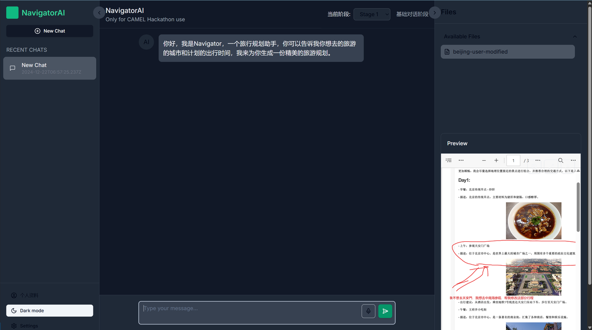
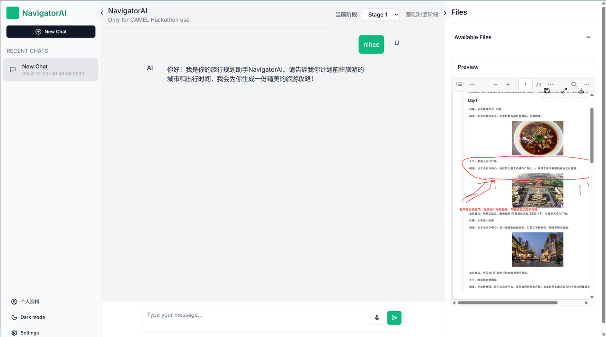
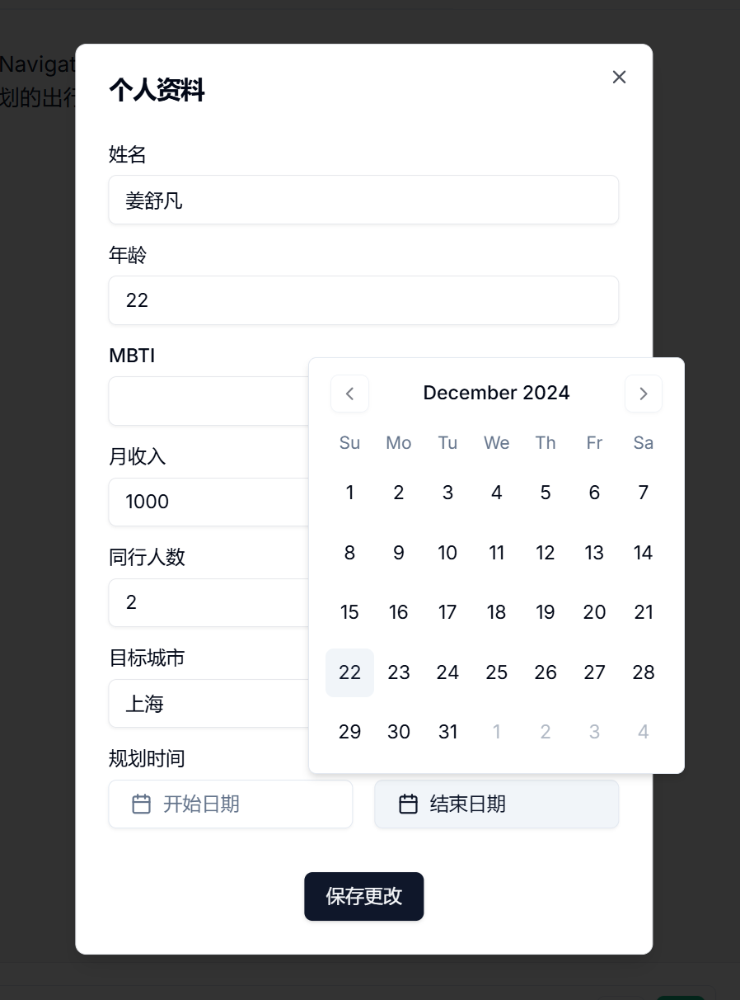
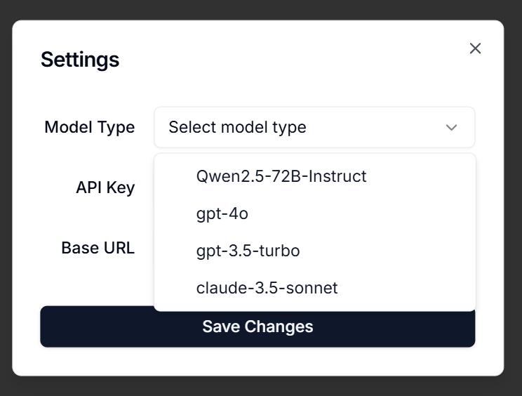

## 5.6 搭配前端食用

综合案例中为了尽可能让大家直观的感受到基于CAMEL框架的Agent产品开发的乐趣，我们还为大家准备了精美的前端，搭配之前的几个后端模块一起构成我们的NavigatorAI旅游出行规划助手应用。

这里只给出一些功能上的描述和简介，前端的具体框架和原理不属于本次我们教程的讨论范围，感兴趣的同学可以自行拓展\~

### UI在线交互模块

UI 在线交互模块是系统中与用户交互的关键部分，旨在通过直观的界面实现对生成行程内容的在线预览、编辑和反馈。用户可以在界面中直接查看生成的 PDF 文档，实时圈选、标注或输入修改意见，系统会根据用户提供的反馈动态调整行程内容。

左右两边的侧边栏分别是历史记录+设置栏和文件交互栏，两侧都支持展开和隐藏，非常便捷和人性化。

支持昼夜模式切换

> Dark mode

> Light mode

1. **PDF 在线渲染** &#x20;

   * 将生成的行程文案以 PDF 格式直接嵌入到界面中，用户可以实时浏览内容。

   * 支持高质量的 PDF 渲染，确保用户能直观查看文字、图片和布局。

2. **动态交互编辑** &#x20;

   * 用户可以直接点击 PDF 文档中的任意内容进行标注或编辑。

   * 提供圈选工具，允许用户高亮文中需要修改的部分并附加文本说明。

   * 输入框支持对具体段落、景点描述或图片的修改建议。

3. **反馈与动态调整** &#x20;

   * 用户的修改意见将自动传递给大模型（LLM），系统分析反馈并对行程内容进行优化。

   * 支持多轮交互，用户可以反复调整文案，直至满意为止。

4. **实时预览** &#x20;

   * 调整后的内容会立即在界面中重新渲染，用户无需等待即可看到更新后的 PDF 文档。

   * 保持高效的交互流程，提升用户体验。

### 个人信息输入模块

个人信息输入模块是系统的重要组成部分，用于收集用户的基础信息以便生成更符合个性化需求的旅游行程。通过直观友好的界面设计，用户可以快速填写相关信息，模块根据这些输入数据定制化生成行程内容。

1. **用户基础信息录入** &#x20;

   * 支持用户输入包括姓名、年龄、MBTI（个性类型）、月收入等个人信息。 &#x20;

   * 数据用于优化旅游规划的推荐内容，例如推荐适合预算的活动和美食。

2. **出行偏好设置** &#x20;

   * 用户可以指定目标城市、同行人数以及出行的具体日期（开始日期和结束日期）。 &#x20;

   * 系统会根据这些信息计算出行程天数并匹配对应的景点和活动。

3) **交互式日历组件** &#x20;

   * 嵌入式日历设计，方便用户快速选择出发日期和返回日期。 &#x20;

   * 界面清晰，操作直观，同时支持日期范围校验，避免选择无效的时间范围。

4) **即时保存与更新** &#x20;

   * 提供“保存更改”按钮，允许用户修改输入信息并实时保存，确保数据更新准确。 &#x20;

   * 便捷的数据交互设计减少了用户的操作负担，提高了使用效率。

### 模型选择

我们的模型选择模块是一款针对多语言模型应用需求设计的配置工具。用户只需要简单几步，就可以在界面中切换模型，并快速完成初始化配置，**随时切换和管理多种主流模型**。

下拉菜单集成了目前支持的模型：

* **Qwen2.5-72B-Instruct**：通义千问团队的最新开源模型。（综合案例中的大部分演示是基于此API）

* **gpt-4o**：拥有强大的推理能力和多模态能力，能够处理一系列复杂任务。

* **gpt-3.5-turbo**：轻量级、响应快。

* **claude-3.5-sonnet**：适合对话生成和自然语言理解的场景。

> **再次提醒**：NavigatorAI遵循[CC BY-NC](https://creativecommons.org/licenses/by-nc/4.0/)协议，仅供学习使用，不能商用！！！

